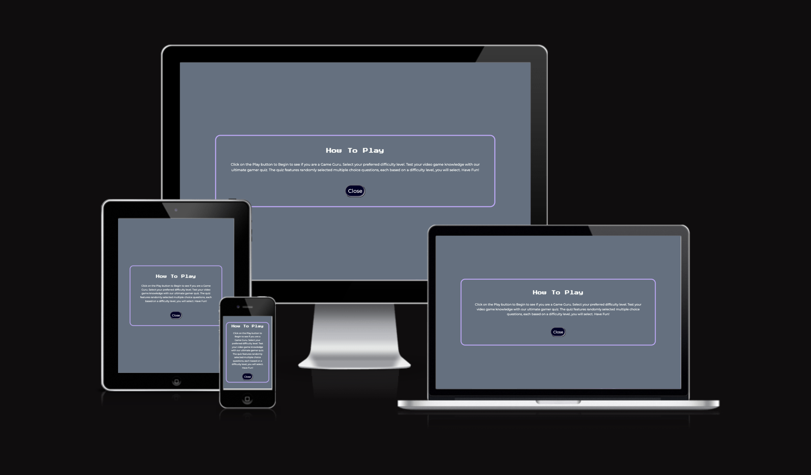
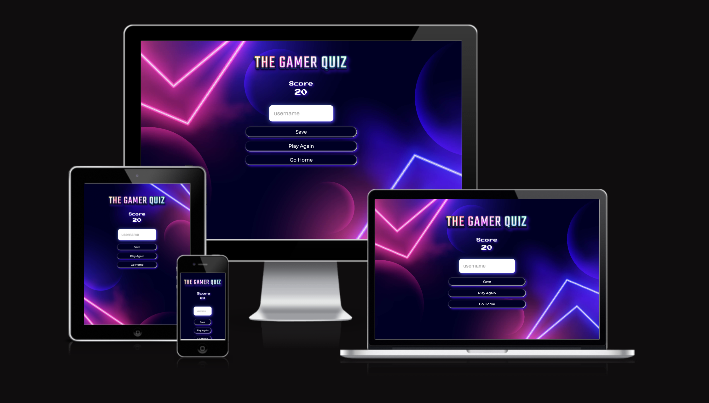

# THE GAMER QUIZ

The Gamer Quiz is a fun interactive front-end web application presented in a quiz format. The quiz format is randomly selected questions based on video games. End Users can test their Gaming knowledge in three different difficulty levels and compete for the top spot on the High Score Leaderboard.

Visit the live site: [The Gamer Quiz](https://zest-studi-o.github.io/P02-The-Gamer-Quiz/)

# Table of contents

- [User Experience (UX)](#User-Experience-UX)

  - [User Stories](#User-Stories)

- [Design](#Design)

  - [Colour Scheme](#Colour-Scheme)
  - [Typography](#Typography)
  - [Imagery](#Imagery)
  - [Wireframes](#Wireframes)
  - [Features](#Features)
  - [Accessibility](#Accessibility)

- [Technologies Used](#Technologies-Used)

  - [Languages Used](#languages-used)
  - [Frameworks, Libraries & Programs Used](#frameworks-libraries--programs-used)

- [Deployment & Local Development](#Deployment--Local-Development)

  - [Deployment](#Deployment)
  - [Local Development](#Local-Development)
    - [How to Fork](#How-to-Fork)
    - [How to Clone](#How-to-Clone)

- [Testing](#Testing)

- [Credits](#Credits)
  - [Code Used](#code-used)
  - [Content](#content)
  - [Media](#media)
  - [Acknowledgments](#Acknowledgments)

---

## User Experience (UX)

#### Key information for the site

This section provides insight into the UX process, focusing on who the Gamer Quiz website is for, the main aims of the project and 
how the website can help users meet their needs.

Project goals:
- To encourage people to take the gamer quiz.
- To let users select different levels of difficulty.
- To provide users with feedback so that they know what they have gotten wrong and to learn the correct answer.
- To allow the users to save their scores and appear on the leaderboard to make it more competitive and appealing to play.

### User Stories

#### First-Time Visitor Goals

- As a first-time visitor, I want to take part in a gaming quiz so that I can test my knowledge about video games.
- As a first-time visitor, I want to play the quiz on different devices so that I can use all my devices at my convenience.
- As a first-time visitor, I want to navigate easily the site so that I can understand quickly the game mechanics.

#### Returning Visitor Goals

- As a returning visitor, I want to select the level of difficulty so that I can play in different modes and test further my knowledge. 

#### Frequent Visitor Goals
- As a frequent visitor, I want to select the level of difficulty so that I can unlock as many questions as possible to improve. 
- As a frequent visitor, I want to be able to log my scores so I can track my progress and get a high rank on the leaderboards.

---

## Design

### Colour Scheme
The site colour palette is based on a technological theme so it could be associated with video games, this colour palette was created using coolors website.

### Typography
For the logo I have used a vector illustration that I customised and exported as a png with transparent background.
I picked a display font for the headings that are related to the quiz theme which is a video game named Press Start 2P and then for the body copy a readable sans serif, optimal for web design such as Montserrat.
The fonts were taken from Google Fonts:

- [Montserrat](https://fonts.google.com/specimen/Montserrat)
- [Press Start 2P](https://fonts.google.com/specimen/Press+Start+2P)

### Imagery

The images are taken from the royalty-free sites credited [here](#Credits).

### Wireframes

Wireframes for desktop, tablet and mobile versions are as follows:

- Home page

- How to play page

- Select difficulty level page

- Game in progress page

- Quit game page

- Finish game page

- High scores page

### Features

#### Existing Features

This website has a home page, a game select page, 3 game pages (easy, medium, difficult), a high scores page, an end page a 404 error page.

**All pages have:**
 
**The Sites title**

 

  * This redirects the user to the home page by clicking on the logo.
  * The user can simply click on it to come back to the home page at any time, providing an easy user experience.
---

**A fav icon**

 

  * This will allow the user to clearly identify the site when having open multiple tabs.
  *  Each page has a unique title that indicates this to the user for easier navigation.
---

**Custom cursor**

  *  A custom cursor video game themed when hovering clickable items on the website.
---

**Home page:**

  * The homepage introduces the user to the website.
  * The user can select to read the instruction, start the quiz or see the high scores. 
---

**How to play:**

  *  From the home page, a modal will open if the user clicks on how to play.   
  *  This page gives instructions on how to take the quiz.
---

**Game select:**

  * If the user clicks on the play button, this page will open
  * The user can select the level of difficulty for the quiz (easy, medium or hard).
---

**Game:**

  * The selected game will open, giving the user the chosen question mode.
---

**End page:**

  * When finishing the quiz, the user will have the option to save the 
  score obtained, play again or return to the home page.
---

**High scores:**

  * This high scores page shows the most recent best scores (maximum 5).

---

**Error 404:**

  * This is a 404 error page that shows in case of an error fetching data from the API.

---

### Features Left to Implement

In the future, I would like to:

- Add a multiplayer version to the game.
- Store data in back-end.
- Add music to the quiz.
- Give a summary of the questions and the correct answers.
- Add a feature in which the player can select the number of questions.

### Accessibility

It is important to have a website that is accessibility friendly, this objective was achieved by:

- Ensuring that images have an alt attribute.
- Using aria labels.
- Using semantic html.
- Making sure that background and foreground colours have high contrast, after an error returned in the nav bar by the lighthouse validator the background colour darkness was increased to contrast higher with the white color applied to the font, the logo also has a drop shadow to enhance visibility and the clickable menu for mobile screens uses a visible font size.
- Using a sans serif font is recommended for web design which is easy to read.

---

## Technologies Used

###  Languages Used

HTML, CSS and JS were used to create this website.

### Frameworks, Libraries & Programs Used

[Balsamiq](https://balsamiq.com/wireframes/) - Used to create wireframes.

[Git](https://git-scm.com/) - For version control.

[GitHub](https://github.com/) - To save and store the files for the website.

[Code from anywhere](https://app.codeanywhere.com/) - To write, edit and save code.

[Google Fonts](https://fonts.google.com/) - To import fonts for the website.

[Font Awesome](https://fontawesome.com/icons) - To add icons to the website.

[Tiny PNG](https://tinypng.com/) - To quickly compress imagery.

[Convertio](https://convertio.co/) - To convert to webp format.

[Birme]( https://www.birme.net/?auto_height=true&image_format=webp) - To convert to webp format.

[Photoshop](https://www.adobe.com/ie/products/photoshop.html) - To edit, resize, crop to size and web optimise imagery.

[Illustrator](https://www.adobe.com/ie/products/illustrator.html) - For the fav icon creation and to edit the text effect template.

[Shields](https://shields.io/) - To add badges to the readme file.

[Amiresponsive](https://ui.dev/amiresponsive) - To generate a mockup in different screen sizes.

[Emoji cursor app](https://www.emojicursor.app/) - I used this app to add the video game controller cursor.

[Formatter](https://chrome.google.com/webstore/detail/json-formatter/bcjindcccaagfpapjjmafapmmgkkhgoa) - To format the API’s Json response.

[Bandicam](https://www.bandicam.com/es/) - To screen record bugs and features.

[Windows photo feature](https://www.microsoft.com/en-us/windows/photo-movie-editor) - To trim screen recording.

[Veed](https://www.veed.io/convert/mp4-to-gif?gad=1&gclid=CjwKCAjwgqejBhBAEiwAuWHioCzHSc5XTTdsnixrxavlvLKEi4i_YeN__Xol0nANQCBhw60caeyF3RoC31wQAvD_BwE) - To convert mp4 to gif

---

## Deployment & Local Development

### Deployment

Github Pages were used to deploy the live website. The instructions to achieve this are below:

1. Log in (or sign up) to Github.
2. Find the repository for this project, Zest-studi-o/P02-The-gamer-quiz.
3. Click on the Settings link.
4. Click on the Pages link in the left-hand side navigation bar.
5. In the Source section, choose main from the drop-down select branch menu. Select Root from the drop-down select folder menu.
6. Click Save. Your live Github Pages site is now deployed at the URL shown.

### Local Development

#### How to Fork

To fork the Zest-studi-o/P02-The-gamer-quiz repository:

1. Log in (or sign up) to Github.
2. Go to the repository for this project, Zest-studi-o/P02-The-gamer-quiz.
3. Click the Fork button in the top right corner.

#### How to Clone

To clone the Zest-studi-o/P02-The-gamer-quiz repository:

1. Log in (or sign up) to GitHub.
2. Go to the repository for this project, Zest-studi-o/P02-The-gamer-quiz.
3. Click on the code button, select whether you would like to clone with HTTPS, SSH or GitHub CLI and copy the link shown.
4. Open the terminal in your code editor and change the current working directory to the location you want to use for the cloned directory.
5. Type 'git clone' into the terminal and then paste the link you copied in step 3. Press enter.

---

## Testing

Please refer to [TESTING.md](TESTING.md) file for all testing carried out.

## Credits

### Code Used

- [Modals](https://www.youtube.com/watch?v=XH5OW46yO8I) - I used this video tutorial to help me with the modal windows.

- [Build a Quiz App - James Q Quick](https://www.youtube.com/watch?v=u98ROZjBWy8&list=PLDlWc9AfQBfZIkdVaOQXi1tizJeNJipEx&index=1) I used this series of videos to teach me how to make a quiz app using html, css and js.
This tutorial builds upon the Code Institute content, teaching how to develop and add features to a QUIZ app, such as a high scores page or save user data to local storage, the tutorial goes further and also explains how to fetch data from an API to display the questions.

- I also used [stack overflow](https://stackoverflow.com/) to troubleshoot errors, [w3schools](https://www.w3schools.com/) and [mdn developer](https://developer.mozilla.org/es/) to read documentation and learn about specific things such as how to fetch.

### Content

All questions were pulled from the following API:
- [Opendb](https://opentdb.com/api_config.php)

###  Media

- [Freepik - starline - background](https://www.freepik.com/free-vector/abstract-geometric-neon-lights-line-3d-background_29887040.htm#&position=2&from_view=collections)

- [Freepik - text effect](https://www.freepik.com/free-vector/realistic-gamer-text-effect_33301158.htm#&position=6&from_view=collections)

- [Freepik - glitch effect background](https://www.freepik.com/free-vector/glitch-background_3865410.htm#&position=1&from_view=collections)

- [Freepik - 404 vector](https://www.freepik.com/free-vector/glitch-error-404-page-background_3916183.htm#&position=0&from_view=collections)

- [Emojipedia - video game fav icon](https://emojipedia.org/video-game/)

### Acknowledgments

- [Derek MCAuley](https://github.com/derekmcauley7), my Code Institute Mentor.
- Tutor support at Code Institute.
