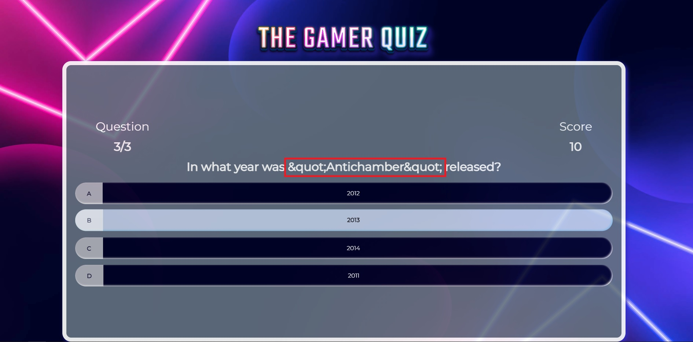
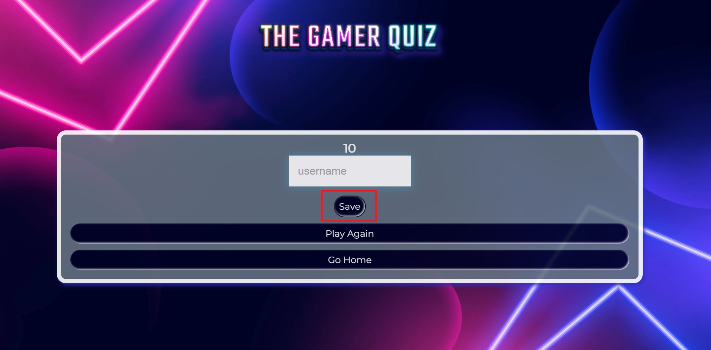
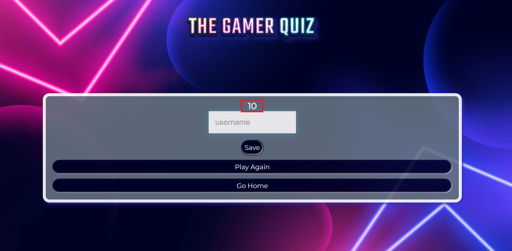
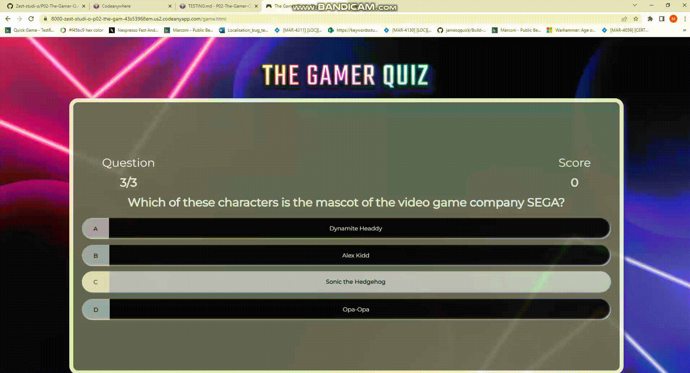
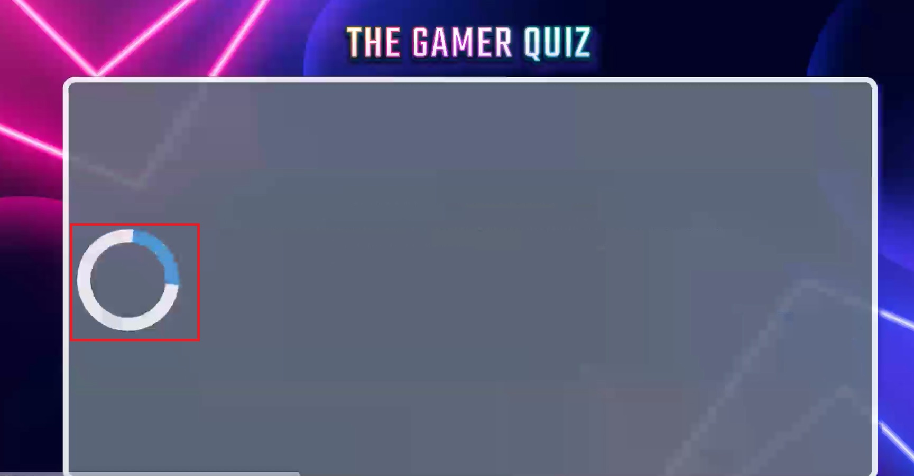
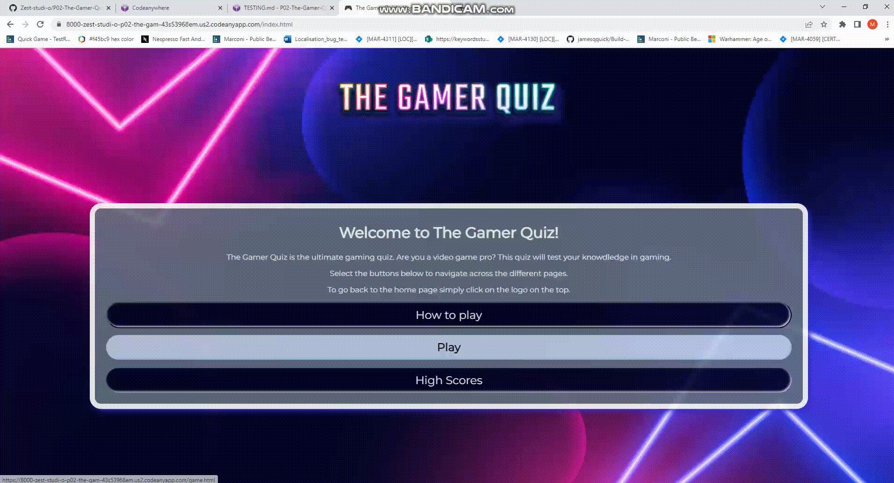
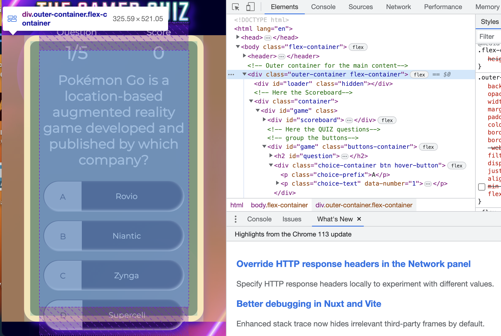

# THE GAMER QUIZ

What the site is about, mockup and live link.

## CONTENTS

* [AUTOMATED TESTING](#AUTOMATED-TESTING)
  * [W3C Validator](#W3C-Validator)
  * [JavaScript Validator](#JavaScript-Validator)
  * [Lighthouse](#Lighthouse)
* [MANUAL TESTING](#MANUAL-TESTING)
  * [Testing User Stories](#Testing-User-Stories)
  * [Full Testing](#Full-Testing)
* [BUG TRACKER](#BUG-TRACKER)
  *  [Solved Bugs](#Solved-Bugs)
  *  [Known Bugs](#known-Bugs)

- - -

## AUTOMATED TESTING

### W3C Validator

[W3C](https://validator.w3.org/) was used to validate the HTML on all pages of the website. It was also used to validate the CSS.

* [index.html](testing/w3/w3-index.png) - .
* [game.html](testing/w3/w3-game.png) - .
* [high-scores.html](testing/w3/w3-highscores.png) - .
* [404.html](testing/w3/w3-404.png) - .
* [style.css](testing/w3/w3-css.png) - .

- - -

### JavaScript Validator

### Lighthouse

I used Lighthouse within the Chrome Developer Tools to test the performance, accessibility, best practices and SEO of the website.

### Desktop Results

### Mobile Results

- - -

## MANUAL TESTING

### Testing User Stories

### Full Testing

## BUG TRACKER

### Solved Bugs

| ID  | CLASS | FEATURE          | DESCRIPTION                                                                          | STEPS TO REPRODUCE                                                                                                                                                           | ACTUAL RESULT                                                                                                                                  | EXPECTED RESULT                                                            | ACTION                                                                                                        | STATUS |
| --- | ----- | ---------------- | ------------------------------------------------------------------------------------ | ---------------------------------------------------------------------------------------------------------------------------------------------------------------------------- | ---------------------------------------------------------------------------------------------------------------------------------------------- | -------------------------------------------------------------------------- | ------------------------------------------------------------------------------------------------------------- | ------ |
| 1   | A     | Location          | Issue                                                   | Steps to reproduce                                                                           | Actual result                                     | Expected result                            | Solution                                                              | FIXED OR NOT FIXED  |
| 1   | A     | Display Questions          | Encoding. Variable displayed in the question section. This variable is shown when fetching data from the database API.                                              | Start the app > select Play > Observe the issue in some of the questions not displaying correctly                                                                           | Some of the questions do not display correctly                                     | The questions display correctly avoiding any code shown                        | Solution: changed innerText for innerHTML                                                          |  FIXED  |
| 2   | C     | Score display          | Button Design. The save button in the score display scores section does not take the other buttons style.                                                   | Start the app > select Play > Finish the game> Observe the issue in the save button                                                                           | The save button looks different in style                                     | The save button looks as the other buttons in the section                        | Solution: this button was part of the form in html which was preventing it from taking the formatting, the code was moved behind the form html closing tag                                                           | NOT FIXED  |
 3   | A     | Score display          | Game logic. The score returned does not match the latest score.                                                    | Start the app > select Play > Finish the game> Observe the issue in the incorrect score returned                                                                        | The counter is returning an incorrect result                                     | Ensure that the counter returns the latest result achieved bye the user                            | When working in other areas this was solved as probably it was something interacting with this feature                                                             | FIXED  |
| 4   | B     | Loader          | Loader display. The loader does not display centered in the container.                                                     | Start the app > select Play and reach the questions section > Observe the issue with the loader                                                                           | The loader is not centered                                     | Ensure that the loader is centered                         | Solution: add flex style to the class outer-container, justify, align center and apply media queries to the score-counter section so the buttons will not overflow                                                       | FIXED |
| 5   | A     | General overflow         | The app overflows the container in certain screen sizes and the background image does not display correctly.                                                    | Start the app > select Small screen sizes in dev tools > Observe the issue with the overflow                                                                           | The app is not totally responsive for certain screen sizes                                     | Ensure that the app is responsive for all screen sizes                        | Solution: after a lot of exploration using the developer console css clamp function was added for the questions, height auto for the outer container, also the intention was removing the background box for small screen sizes to avoid any overlap but it was observed in the dev console that the text reads better and it also improved the app look and vibe without the box, so this was removed for all screen sizes for a more modern look                                               | FIXED |

### Known Bugs

There are no remaining known bugs, all of them have been fixed.

---