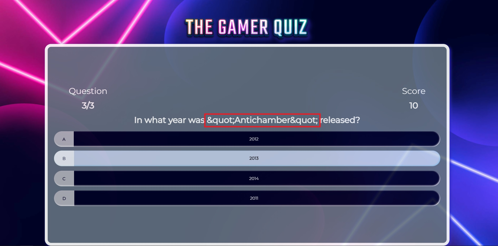

# THE GAMER QUIZ

What the site is about, mockup and live link.

## CONTENTS

* [AUTOMATED TESTING](#AUTOMATED-TESTING)
  * [W3C Validator](#W3C-Validator)
  * [JavaScript Validator](#JavaScript-Validator)
  * [Lighthouse](#Lighthouse)
* [MANUAL TESTING](#MANUAL-TESTING)
  * [Testing User Stories](#Testing-User-Stories)
  * [Full Testing](#Full-Testing)
* [BUG TRACKER](#BUG-TRACKER)
  *  [Solved Bugs](#Solved-Bugs)
  *  [Known Bugs](#known-Bugs)

- - -

## AUTOMATED TESTING

### W3C Validator

[W3C](https://validator.w3.org/) was used to validate the HTML on all pages of the website. It was also used to validate the CSS.

* [index.html](testing/w3/w3-index.png) - Passed.
* [game.html](testing/w3/w3-game.png) - No errors, 1 Warning. The warning is for an empty H2 tag. This is where the question is inserted using jQuery.
* [highscores.html](testing/w3/w3-highscores.png) - Passed.
* [404.html](testing/w3/w3-404.png) - Passed.
* [500.html](testing/w3/w3-500.png) - Passed.

* [style.css](testing/w3/w3-css.png) - Passed, no errors found.

- - -

### JavaScript Validator

### Lighthouse

I used Lighthouse within the Chrome Developer Tools to test the performance, accessibility, best practices and SEO of the website.

### Desktop Results

### Mobile Results

- - -

## MANUAL TESTING

### Testing User Stories

### Full Testing

## BUG TRACKER

### Solved Bugs

| ID  | CLASS | FEATURE          | DESCRIPTION                                                                          | STEPS TO REPRODUCE                                                                                                                                                           | ACTUAL RESULT                                                                                                                                  | EXPECTED RESULT                                                            | ACTION                                                                                                        | STATUS |
| --- | ----- | ---------------- | ------------------------------------------------------------------------------------ | ---------------------------------------------------------------------------------------------------------------------------------------------------------------------------- | ---------------------------------------------------------------------------------------------------------------------------------------------- | -------------------------------------------------------------------------- | ------------------------------------------------------------------------------------------------------------- | ------ |
| 1   | A     | Location          | Issue                                                   | Steps to reproduce                                                                           | Actual result                                     | Expected result                            | Solution                                                              | FIXED OR NOT FIXED  |
| 1   | A     | Display Questions          | Encoding. Variable displayed in the question section. This variable is shown when fetching data from the database API.                                                 | Start the app > select Play > Observe the issue in some of the questions                                                                           | Some of the questions does not display correctly                                     | The questions display correctly avoiding any code shown                        | Solution not found                                                           | NOT FIXED  |
| 2   | C     | Location          | Issue                                                   | Steps to reproduce                                                                           | Actual result                                     | Expected result                            | Solution                                                              | FIXED OR NOT FIXED  |
### Known Bugs

There are no remaining known bugs, all of them have been fixed.

---