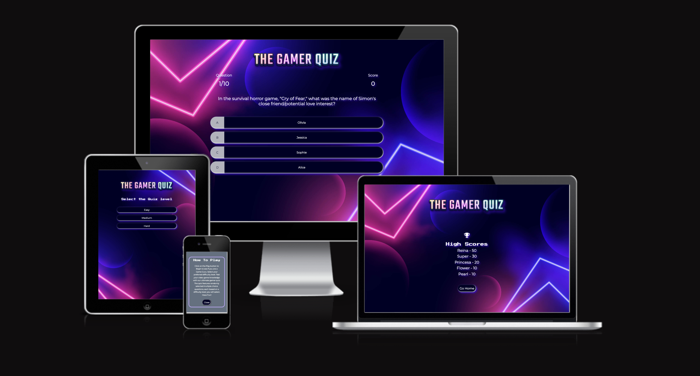
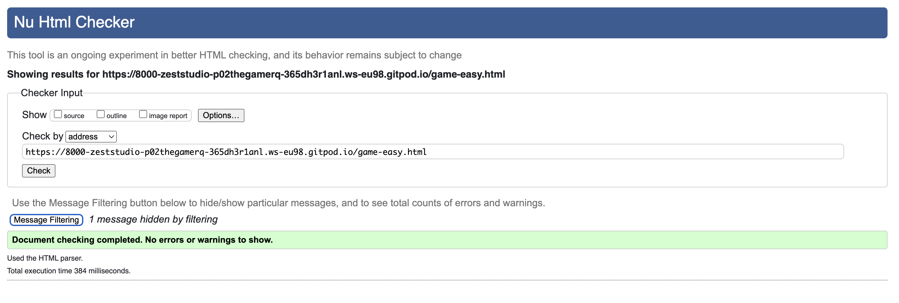
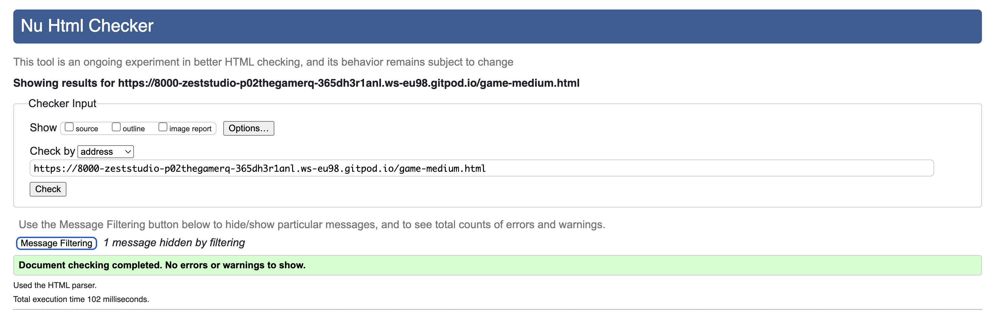
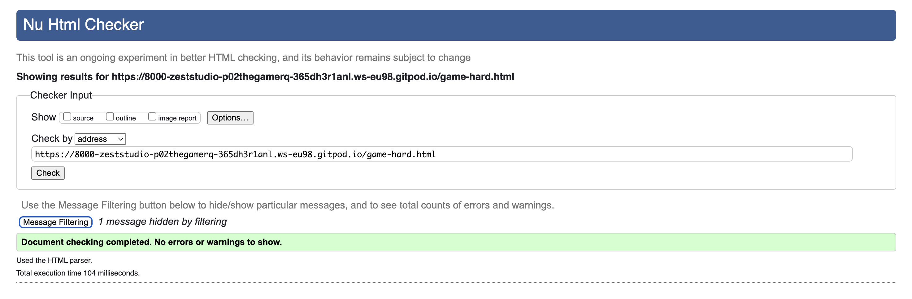
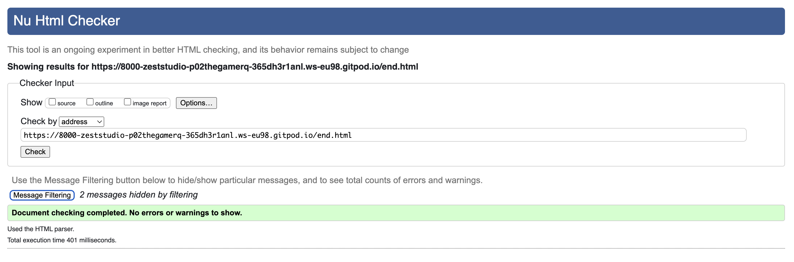
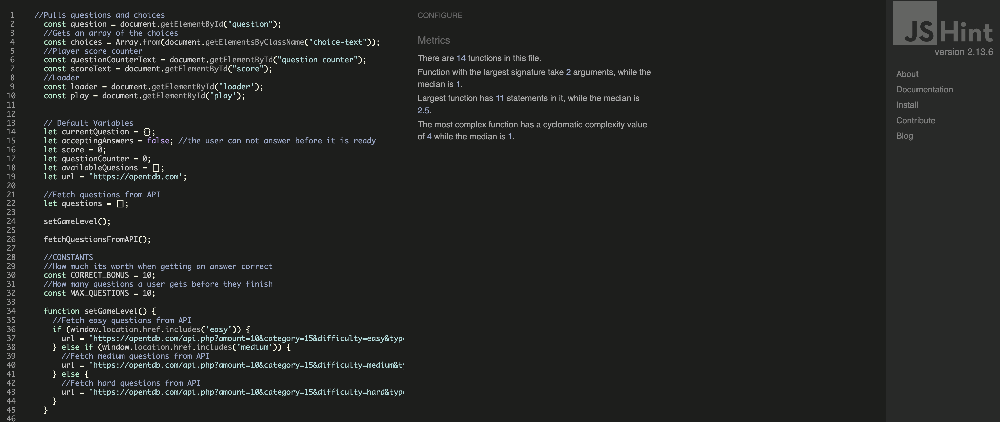
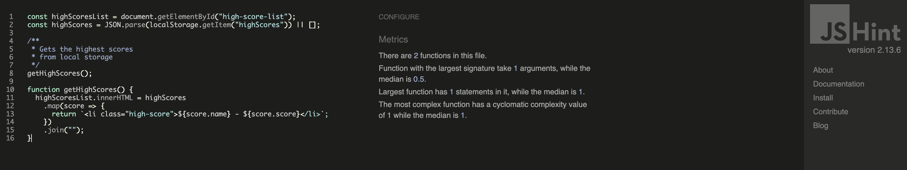
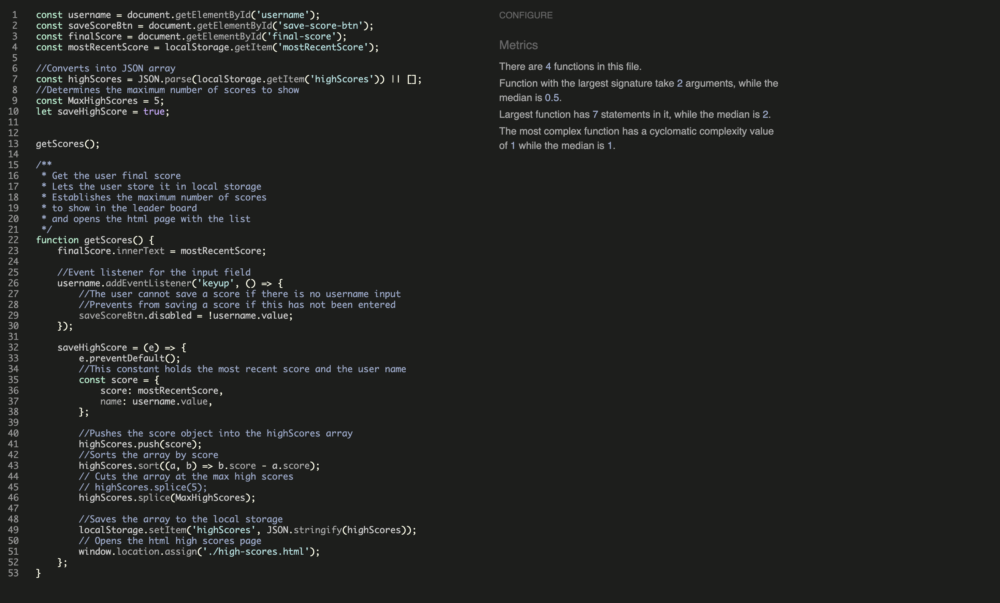
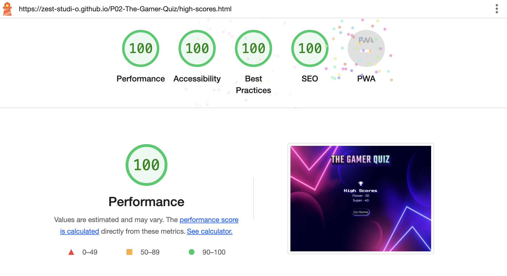
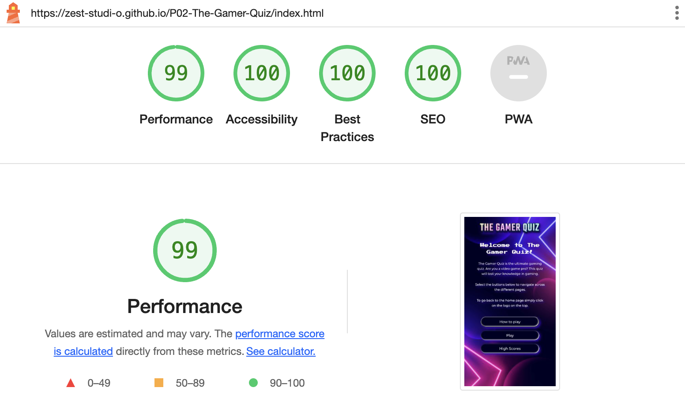

# THE GAMER QUIZ

The Gamer Quiz is an interactive front-end web application in quiz format, based on video games.

Visit the live site: [The Gamer Quiz](https://zest-studi-o.github.io/P02-The-Gamer-Quiz/)

## CONTENTS

* [AUTOMATED TESTING](#AUTOMATED-TESTING)
  * [W3C Validator](#W3C-Validator)
  * [JavaScript Validator](#JavaScript-Validator)
  * [Lighthouse](#Lighthouse)
* [MANUAL TESTING](#MANUAL-TESTING)
  * [Testing User Stories](#Testing-User-Stories)
  * [Full Testing](#Full-Testing)
* [BUG TRACKER](#BUG-TRACKER)
  *  [Solved Bugs](#Solved-Bugs)
  *  [Known Bugs](#known-Bugs)

- - -

Manual testing was carried out as soon as the project started using exploratory testing techniques and a list of bugs was identified and placed in a table to tackle.
At the same time as building each page, the site was tested in different screen sizes using developer tools to better adjust the design and make sure that it is responsive in all screen sizes.
Afterwards, formal test cases were developed and executed.
Automated testing was carried out at a later stage using validators and all errors were fixed, it was checked that all user goals are met and after this, a test case table was created to test the website using different devices and screen sizes. To finish, the project was shared in Slack for peer review.

## AUTOMATED TESTING

### W3C Validator

[W3C](https://validator.w3.org/) was used to validate the HTML on all pages of the website. It was also used to validate the CSS.

#### Home - Passed, no errors.
 

#### Game select - Passed, no errors.
 

#### Game easy - Passed, no errors.

#### Game medium - Passed, no errors.

#### Game hard - Passed, no errors.

#### High Scores - Passed, no errors.

#### End - Passed, no errors.
This heading is used to pull the data with JS. 

#### 404 - Passed, no errors.

### W3C Validator

No errors were found when passing through the official
[Jigsaw Validator](https://jigsaw.w3.org/css-validator/)

#### Style - Passed, no errors.

- - -

### JavaScript Validator (to complete again and add screenshots)

[jshint](https://jshint.com/) was used to validate the JavaScript.

#### Script - Passed.
No errors found.

#### Game - Passed.
No errors found. 
Warnings about three undefined variables, however, those are being defined.
 

#### High scores - Passed. 
No errors found. 
A warning about an undefined variable, however, this is being defined.

#### End - Passed. 
No errors found. 
A warning about an undefined variable and an unused variable however, those are being defined and used.

### Lighthouse

I used Lighthouse within the Chrome Developer Tools to test the performance, accessibility, best practices and SEO of the website.

#### Desktop Results

#### Mobile Results

---

- - -

## MANUAL TESTING

### Testing User Stories

`First-Time Visitors`
| Goals | How are they achieved? |
| :--- | :--- |
| As a first-time visitor, I want to take part in a gaming quiz so that I can test my knowledge about video games. | The quiz questions are pulled from an API which offer a varied range of questions |
| As a first-time visitor, I want to play the quiz in different devices so that I can use all my devices at my convenience. | The game is fully responsive and can be played in any screen size |
| As a first-time visitor, I want to navigate easily the site so that I can understand quickly the game mechanics. | The game is easy to understand and further instructions are provided in how to play |

`Returning Visitors`
| Goals | How are they achieved? |
| :--- | :--- |
| As a returning visitor, I want to select the level of difficulty so that I can play in different modes and test further my knowledge | There is a feature which enables the user to select this once hitting play |

`Frequent Visitors`
| Goals | How are they achieved? |
| :--- | :--- |
| As a frequent visitor, I want to select the level of difficulty so that I can unlock as many questions as possible to improve. | The game select feature enables the user to select more challenging questions as they progress in knowledge |
| As a frequent visitor, I want to be able to log my scores so I can track my progress and get a high rank in the leader boards. | The game has a feature which enables to load scores and see the top 5 ranking |

### Full Testing
Full testing was performed on the following devices:

- Desktop:
  - Custom Gaming computer (Raven) with 2 screens set up 24 inches and Windows OS
- Laptop:
  - Macbook Pro 2023 14 inches screen and Mac OS
- Android Mobile Devices:
  - Samsung Galaxy S20 
  - Samsung Galaxy A50 

Each device tested the site using the following browsers:

- Google Chrome
- Safari
- Firefox

### Test Cases
`All pages`
| Feature | Expected Result | Testing Performed | Actual Result | Pass/Fail |
| --- | --- | --- | --- | --- |
| The Sites title | Clicking on the logo link directs the user back to the home page | Clicked title | Home page loads | Pass |
| Fav icon | The fav icon shows when visiting the page | Visited page | The fav icon correctly displays | Pass |
| Custom cursor | The gamepad cursor displays when hovering over clickable content | Hover over buttons and logo | The gamepad cursor displays | Pass |
| Hover button effect | The buttons change color when hovering over| Hover over the buttons | The colour changes as expected when the mouse is on the buttons | Pass |

`Home page`
| Feature | Expected Result | Testing Performed | Actual Result | Pass/Fail |
| --- | --- | --- | --- | --- |
| How to play modal | The modal open and closes correctly| Click on how to play, click on close | The content is shown and hidden as expected | Pass |
| Play | The play button directs the user to the game select page | Click on the play button | The game select page loads | Pass |
| High scores | The high scores button directs the user to the game high scores page | Click on the high scores button | The high scores page loads | Pass |

`Game select page`
| Feature | Expected Result | Testing Performed | Actual Result | Pass/Fail |
| --- | --- | --- | --- | --- |
| Easy Quiz | The easy button directs the user to the easy quiz, questions from video game category, easy are loaded from the API | Click on the easy button | The easy quiz page loads pulling easy questions from the API | Pass |
| Medium Quiz | The medium button directs the user to the easy quiz, questions from video game category, medium are loaded from the API | Click on the medium button | The medium quiz page loads pulling medium questions from the API | Pass |
| Hard Quiz | The hard button directs the user to the hard quiz, questions from video game category, hard are loaded from the API | Click on the hard button | The hard quiz page loads pulling hard questions from the API | Pass |

`Game pages`
| Feature | Expected Result | Testing Performed | Actual Result | Pass/Fail |
| --- | --- | --- | --- | --- |
| Loader | A loader shows while the questions are being populated | Click on any game difficulty | The loader shows while waiting for the questions | Pass |
| Question counter | The current question and total of questions shows on top | Play any game | The question counter is showing correctly | Pass |
| Score board | The current score shows on top of the questions | Play any game | The questions score is showing correctly | Pass |
| Colour user feedback | The selected question takes the colour green if it is correct or red if it is incorrect | Play any game | The questions colours display correctly | Pass |

`End page`
| Feature | Expected Result | Testing Performed | Actual Result | Pass/Fail |
| --- | --- | --- | --- | --- |
| Game score | The score obtained in the game displays on top | Play any game and reach the end page | The correct score displays | Pass |
| Enter username | The user can enter their username | Play any game, reach the end page and enter a username | The username is correctly entered | Pass |
| Save results | The button save results allows to save a user name and the quiz obtained results, if no username if entered this prevents the user from saving an empty username | Play any game, reach the end page and enter a username, try to save without entering a user name | The feature works as expected | Pass |
| Play again | The play again button directs the user to the game selection page | Click on the play again button | The game select page loads | Pass |
| Go home | The go home button directs the user to the home page | Click on the go home button | The home page loads | Pass |

`High scores page`
| Feature | Expected Result | Testing Performed | Actual Result | Pass/Fail |
| --- | --- | --- | --- | --- |
| Results list | The list shows the top 5 highest scores | Play any game, reach the end of the page, save scores more than 5 times | The top 5 scores are shown | Pass |
| Go home | The go home button directs the user to the home page | Click on the go home button | The home page loads | Pass |
---

## BUG TRACKER

### Solved Bugs

| ID  | CLASS | FEATURE          | DESCRIPTION                                                                          | STEPS TO REPRODUCE                                                                                                                                                           | ACTUAL RESULT                                                                                                                                  | EXPECTED RESULT                                                            | ACTION                                                                                                        | STATUS |
| --- | ----- | ---------------- | ------------------------------------------------------------------------------------ | ---------------------------------------------------------------------------------------------------------------------------------------------------------------------------- | ---------------------------------------------------------------------------------------------------------------------------------------------- | -------------------------------------------------------------------------- | ------------------------------------------------------------------------------------------------------------- | ------ |
| 1   | A     | Location          | Issue                                                   | Steps to reproduce                                                                           | Actual result                                     | Expected result                            | Solution                                                              | FIXED OR NOT FIXED  |
| 1   | A     | Display Questions          | Encoding. Variable displayed in the question section. This variable is shown when fetching data from the database API.                                              | Start the app > select Play > Observe the issue in some of the questions not displaying correctly                                                                           | Some of the questions do not display correctly                                     | The questions display correctly avoiding any code shown                        | Solution: changed innerText for innerHTML                                                          |  FIXED  |
| 2   | C     | Score display          | Button Design. The save button in the score display scores section does not take the other buttons style.                                                   | Start the app > select Play > Finish the game> Observe the issue in the save button                                                                           | The save button looks different in style                                     | The save button looks as the other buttons in the section                        | Solution: this button was part of the form in html which was preventing it from taking the formatting, the code was moved behind the form html closing tag                                                           | FIXED  |
 3   | A     | Score display          | Game logic. The score returned does not match the latest score.                                                    | Start the app > select Play > Finish the game> Observe the issue in the incorrect score returned                                                                        | The counter is returning an incorrect result                                     | Ensure that the counter returns the latest result achieved bye the user                            | When working in other areas this was solved as probably it was something interacting with this feature                                                             | FIXED  |
| 4   | B     | Loader          | Loader display. The loader does not display centered in the container.                                                     | Start the app > select Play and reach the questions section > Observe the issue with the loader                                                                           | The loader is not centered                                     | Ensure that the loader is centered                         | Solution: add flex style to the class outer-container, justify, align center and apply media queries to the score-counter section so the buttons will not overflow                                                       | FIXED |
| 5   | A     | General overflow         | The app overflows the container in certain screen sizes and the background image does not display correctly.                                                    | Start the app > select Small screen sizes in dev tools > Observe the issue with the overflow                                                                           | The app is not totally responsive for certain screen sizes                                     | Ensure that the app is responsive for all screen sizes                        | Solution: after a lot of exploration using the developer console css clamp function was added for the questions, height auto for the outer container, also the intention was removing the background box for small screen sizes to avoid any overlap but it was observed in the dev console that the text reads better and it also improved the app look and vibe without the box, so this was removed for all screen sizes for a more modern look                                               | FIXED |
| 6   | A     | Overflow         | The app overflows the background image.                                                    | Start the app > select dimensions responsive (747x375) screen sizes in dev tools > Observe the issue with the overflow                                                                           | The app is still not responsive for certain screen sizes             | Ensure that the app is responsive for all screen sizes                        | Solution: adjust the images with Photoshop for problematic screen sizes and handle with media queries      | FIXED |

### Known Bugs

There are no remaining known bugs, all of them have been fixed.

---